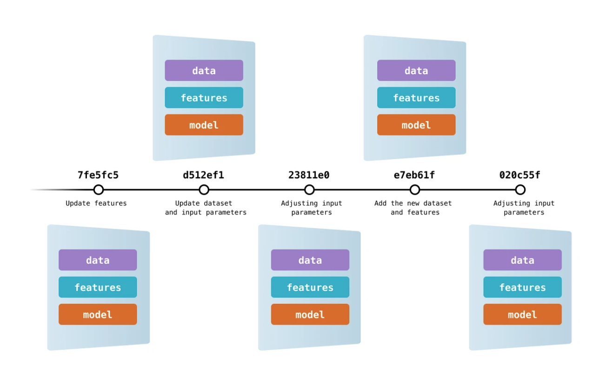
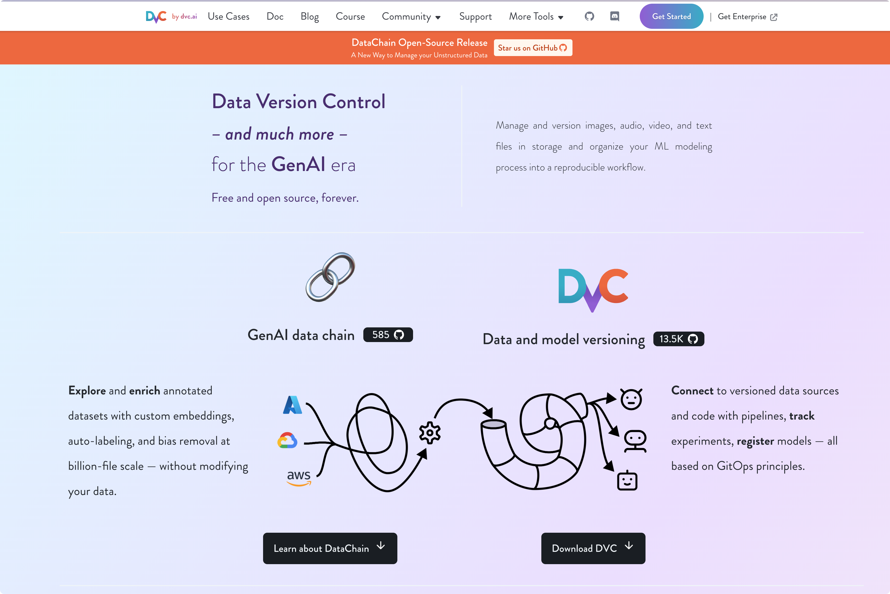
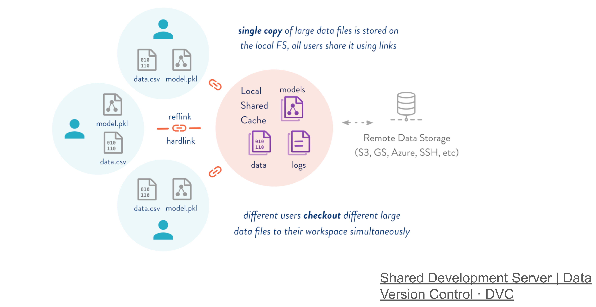

## 介绍
作为一名算法工程师，你是否有这样的困惑，每个实验的**数据**（配置）**文件**和**模型文件**，**模型结果**无法很好的进行版本管理

这三者的匹配是很麻烦的一个事情，当你做了很多次实验之后，你发现，诶，这个结果对应的参数配置是哪套，对应的数据处理方法是什么？模型文件是怎么命名的，面对文件夹里的一堆开始拼命回忆和翻找

这时候就会想要个能够对数据和模型文件进行版本管理的工具，想要回退某个版本，直接git checkout就可以了

代码我们通常会使用git工具，进行版本管理追踪，但是对于数据和模型文件等体积较大的非文本文件，git无能为力，你也许会自然而然想到lfs，但是我试了，git-lfs的效率和容错率让我放弃了

## DVC-DataVersionControl

终于，我发现了一个神器，

[Versioning Data and Models](https://dvc.org/doc/use-cases/versioning-data-and-models)

Data Version Control（DVC）配合git能够一站式管理数据和模型，开源易用，使用`pip install `就能安装，对于我这个pythoner来说，太友好了

## 大致原理
DVC_通过编码实现数据版本_控制。您可以生成简单的[元文件](https://dvc.org/doc/user-guide/project-structure)一次，描述要跟踪的数据集、ML 工件等。这些元数据可以放在 Git 中代替大文件。现在，您可以使用 DVC 创建数据[快照](https://dvc.org/doc/command-reference/add)、[恢复](https://dvc.org/doc/command-reference/checkout)以前的版本、[重现](https://dvc.org/doc/command-reference/repro)实验、记录不断变化的[指标](https://dvc.org/doc/command-reference/metrics)等等！

使用git来管理`.dvc/`目录下的元文件，然后dvc工具通过解析元文件记录来操作（创建和恢复）大型文件。

From a very high-level point of view, DVC works as follows:

1. A Git project is initialized as a DVC project (dvc init).
2. Adding a data file to the DVC version control system moves the file to the local cache, letting Git track only the corresponding .dvc file.
3. Files in the local cache can be synced with a remote repository (dvc push).
4. At any time, files can be synced from the remote repository to the local cache (dvc fetch) or from the local cache to the working folder (dvc pull).

## 本地缓存
**The strength of having a local cache is allowing **_**local**_** sharing among projects and users:**

## 参考资料
[Reproducible Deep Learning Lecture 4.pptx](https://www.yuque.com/attachments/yuque/0/2024/pptx/2637180/1723908420069-50f5a546-dc09-42d5-bcd9-454ae3c29522.pptx)