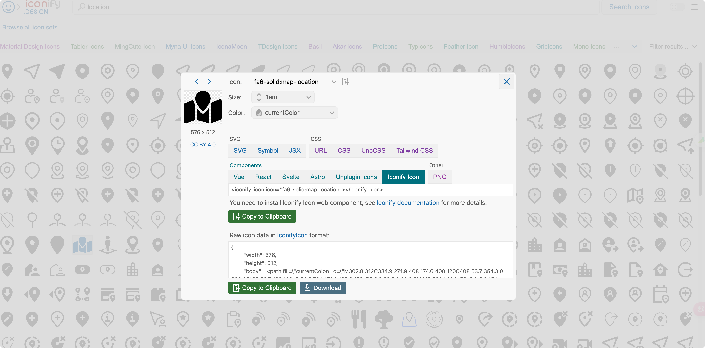

## 使用外部图标
1. 费老的feffery-antd-components方法

> <font style="color:rgb(47, 48, 52);">20230619-在dash应用中使用fontawesome外部图标 </font>
>
> <font style="color:rgb(47, 48, 52);">第一步：在 </font>[https://fontawesome.com/download](https://fontawesome.com/download)<font style="color:rgb(47, 48, 52);"> 中选择“free for web”资源进行下载 </font>
>
> <font style="color:rgb(47, 48, 52);">第二步：解压下载内容后，将其中的css、webfonts文件夹粘贴到你的dash应用项目对应的assets目录下 </font>
>
> <font style="color:rgb(47, 48, 52);">第三步：参考本例源码的方式，将你在 </font>[https://fontawesome.com/icons](https://fontawesome.com/icons)<font style="color:rgb(47, 48, 52);"> 中找到的免费图标对应的class名复制下来，作为相应html.I元素的className即可 </font>
>
> <font style="color:rgb(47, 48, 52);">链接：</font>[https://pan.baidu.com/s/1MvYxdbQ2yvQT-BT5X96asw](https://pan.baidu.com/s/1MvYxdbQ2yvQT-BT5X96asw)<font style="color:rgb(47, 48, 52);"> 提取码：32h5 </font>
>

但是我发现fontaewsome有很多图标是需要pro的，这迫使我又找到了下面这种方法，也非常简单易用：

github 地址[https://github.com/snehilvj/dash-iconify](https://github.com/snehilvj/dash-iconify)


这是dmc项目的一个子部分，里面有一个开源的icon社区可以给我们免费使用，网址是[https://icon-sets.iconify.design/](https://icon-sets.iconify.design/)，在这里只需要复制名字即可，然后再代码里添加，能与fac无缝结合。

## 高级回调技巧-ctx

## 匹配回调 ALL 和 MATCH
比如我们有一堆按钮，我们可以希望将他们的点击次数汇总到一起，这时候就用到了ALL；

那如果我们的场景是点击哪个按钮，想让哪个按钮有反应，其他不动，这时候就用到了MATCH；

```python
app.layout = html.Div([
    # 使用html.Div容器来包含按钮列表
    fac.AntdSpace(
        [
            fac.AntdTooltip(
                fac.AntdButton(
                    f"按钮{i}",
                    id={"type": "button", "index": i},
                    type="primary",
                ),
                id={"type": "tooltip", "index": i},
                # title="nClicks: 0",
            )
            for i in range(10)
        ],
        wrap=True,
    ),
    html.Div(id='sum_nclicks')
])

@app.callback(
    Output('sum_nclicks', 'children'),
    Input({'type': 'button', 'index': ALL}, 'nClicks')
)
def callback_func(n_clicks):
    """
    汇总所有按钮的点击次数
    """
    # print(n_clicks)
    if n_clicks:
        # 将 None 替换为 0 进行求和
        return f'总点击次数：{sum(click if click is not None else 0 for click in n_clicks)}'

    return '总点击次数：0'

@app.callback(
    Output({"type": "button", "index": MATCH}, "danger"),
    Output({"type": "tooltip", "index": MATCH}, "title"),
    Input({"type": "button", "index": MATCH}, "nClicks"),
    prevent_initial_call=True,
)
def update_buttons(nClicks):
    return bool(nClicks), f"nClicks: {nClicks}"
```