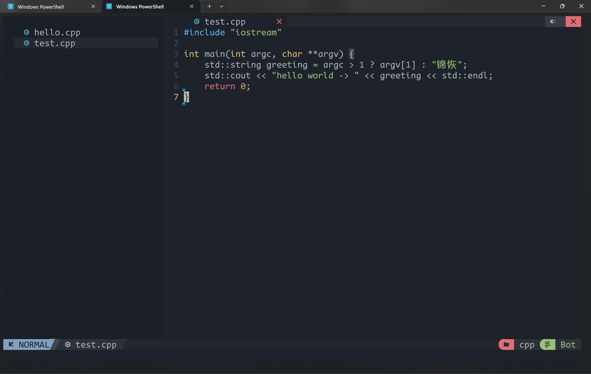
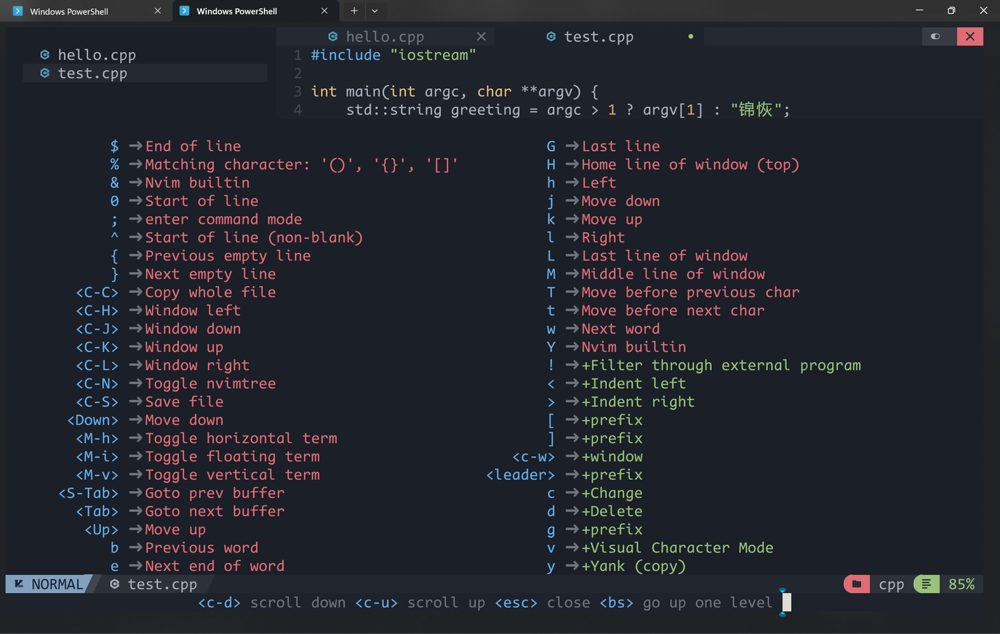
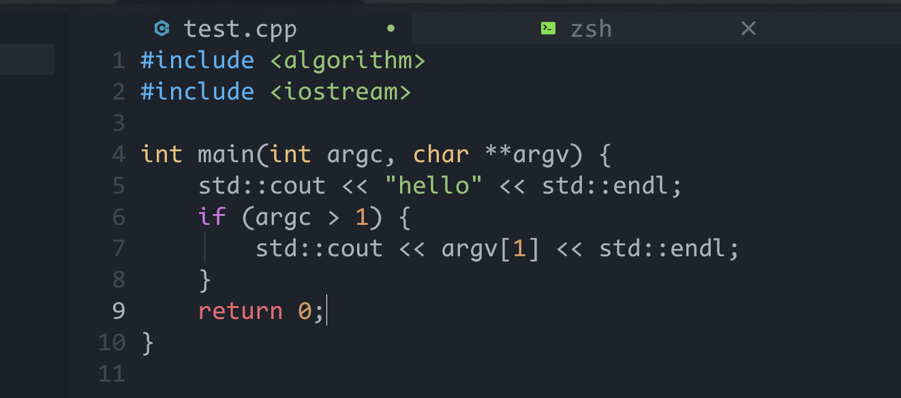
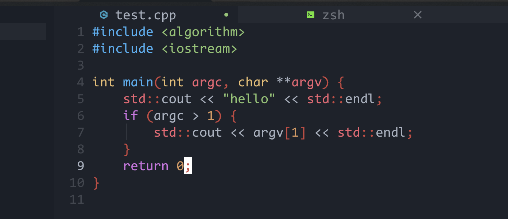
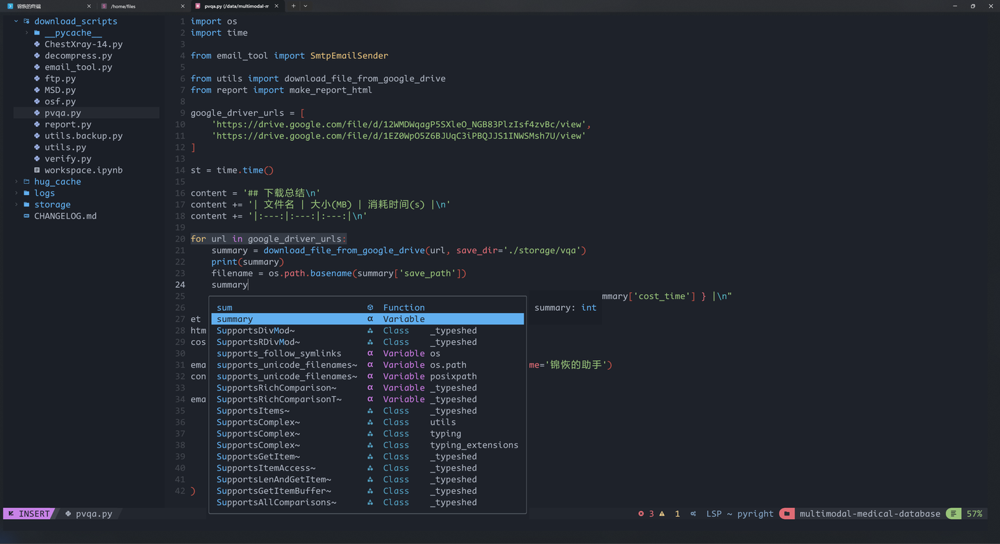
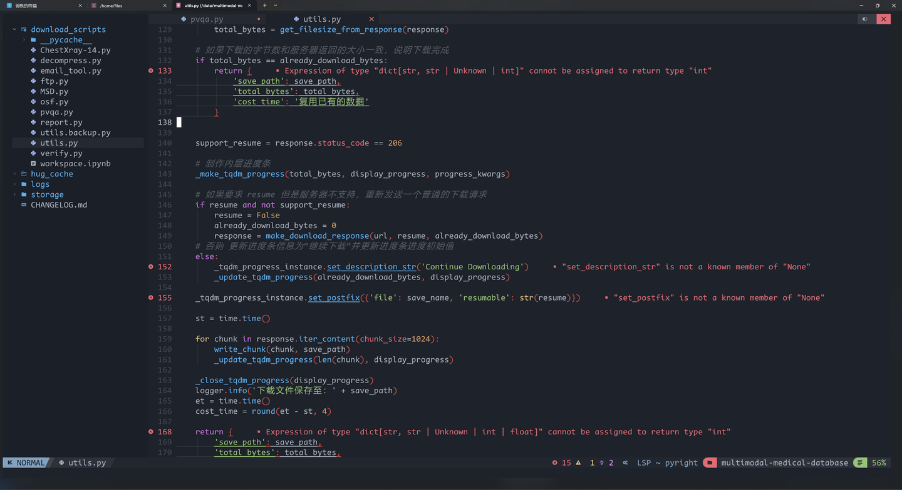
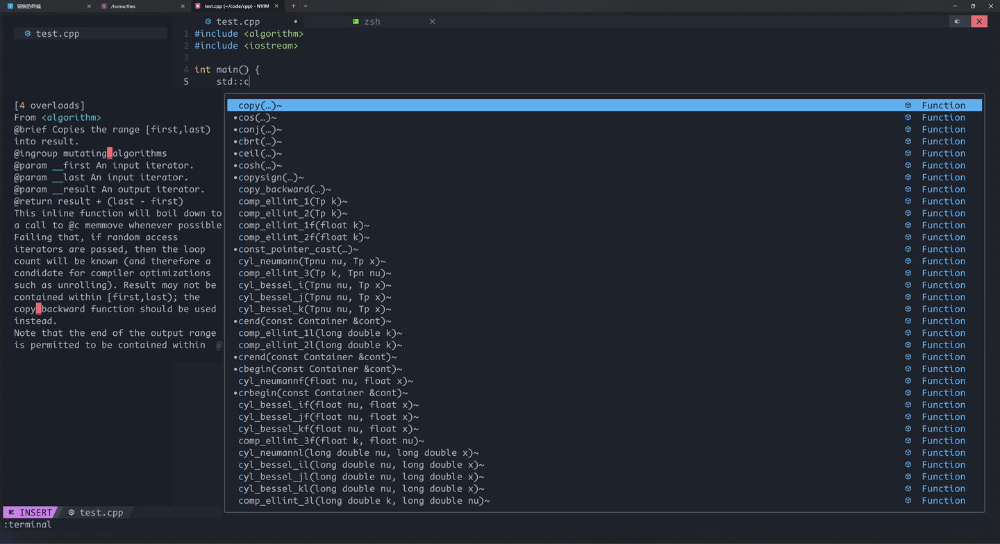
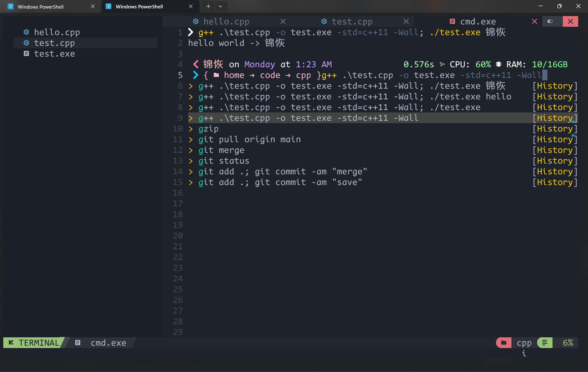
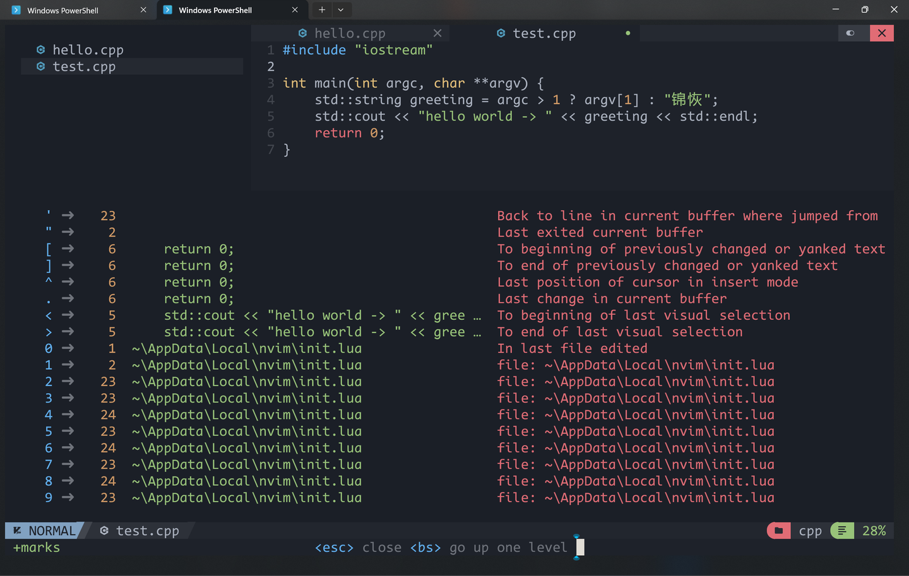
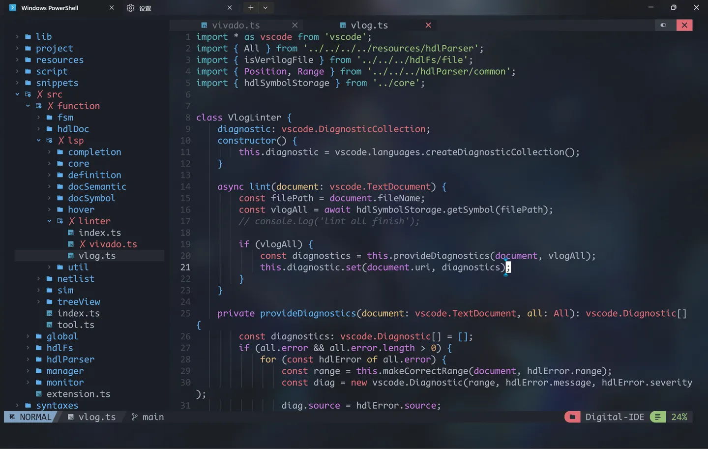

## 前言
最近打算入坑 neovim ，发现这玩意儿的配置过程还是很简单的，简单记录一下，免得后面忘记一些关键路径了。

我将 neovim 的本体安装，packer包管理器安装，一个基础配置写成了简单的脚本，阁下只需要直接执行这个脚本就能全自动完成配置了。

如果你对 neovim 的具体配置细节感兴趣，Alejandro Londoño 写过一篇很棒的博客，阁下不妨移步此处：[How to Set up Neovim for Windows and Linux with Lua and Packer](https://link.zhihu.com/?target=https%3A//dev.to/slydragonn/how-to-set-up-neovim-for-windows-and-linux-with-lua-and-packer-2391)

除此之外，我在我的个人博客中发布了一个更加私有的部署流程，如果你希望得到和本篇文章中完全一致的效果，可以参考我的私有博客：

[汇尘轩 - 锦恢的博客kirigaya.cn/blog/article?seq=134](https://link.zhihu.com/?target=https%3A//kirigaya.cn/blog/article%3Fseq%3D134)

---

## 准备
在正式开始前，阁下还需要做如下准备：

+ 一个带有 npm 的 nodejs 环境（没有的移步 [nodejs 官网](https://link.zhihu.com/?target=https%3A//nodejs.org/en/download)）
+ Nerd 字体，并将你的终端字体设置成 Nerd 字体（没有的移步 [Nerdfont Download](https://link.zhihu.com/?target=https%3A//www.nerdfonts.com/font-downloads)）

---

## 安装
### Windows
以 powershell 为例：

```bash
# install nvim first
wget https://github.com/neovim/neovim/releases/download/nightly/nvim-win64.msi -O nvim-win64.msi
./nvim-win64.msi

# install package manager & basic config
git clone https://github.com/NvChad/NvChad $env:USERPROFILE/Downloads/NvChad

# deploy config
mkdir $env:LOCALAPPDATA/nvim
cp -r $env:USERPROFILE/Downloads/NvChad/* $env:LOCALAPPDATA/nvim
```

重启终端，输入 nvim，输入 y 开始安装剩余插件。

---

### Linux
以 zsh 终端为例，首先请以 sudo 权限安装 libfuse2

```bash
sudo apt install libfuse2
```

然后直接运行下方的脚本

```bash
# 保存为 nvim.bash，然后 source nvim.bash
mkdir -p ~/download

# install nvim first
wget -c -P ~/download https://github.com/neovim/neovim/releases/download/nightly/nvim.appimage
chmod u+x ~/download/nvim.appimage

NVIM_ALIAS=$(cat ~/.zshrc | grep "alias nvim")
L=${#NVIM_ALIAS}
zero="0"
if [ "$L" = "$zero" ]; then
  echo "alias nvim=~/download/nvim.appimage" >> ~/.zshrc
fi
alias nvim=~/download/nvim.appimage

# install package manager & basic config
git clone https://github.com/NvChad/NvChad ~/download/NvChad

# deploy config
mkdir -p ~/.config/nvim
cp -r ~/download/NvChad/* ~/.config/nvim
nvim
```

---

## nvim 的配置文件
简单了解一下 nvim 的配置文件结构（如果你不感兴趣可以直接跳到下一章）：

```bash
# Windows 下的配置文件目录
$env:LOCALAPPDATA/nvim

# Linux 下的配置文件目录
~/.config/nvim
```

默认情况下配置文件夹是不存在的，你需要自己创建。借用Alejandro Londoño的博客中的code，nvim 文件夹下应该有着如下的结构：

```bash
~/.config/nvim
├──   lua/**config files**
└──   init.lua
```

init.lua 是 nvim 的入口文件，类似于 vim 的 .vimrc 文件。

init.lua 中可以使用 require(module_name) 包含其他的配置脚本，那么 nvim 会去找到 ./lua/module_name.lua 并逐行解释运行。

如果你希望运行别人的 nvim 配置项目，只需要将项目摆放成上面那个样子即可。

---

## 基础使用
### 基础操作——复习vim
nvim 大部分基础操作与 vim 完全相同。

打开文件 test.cpp：

```bash
$ nvim test.cpp
```



基本操作与 vim类似：

+ Normal 模式下按下 i 进入 Insert 模式
+ Insert/Visual 模式下按下 Esc 进入 Normal 模式
+ Normal 模式下按下 v 进入 Visual 模式
+ Visual 模式下 y 复制，x 或者 c 剪贴，p 粘贴
+ Normal 模式下 u 撤销（相当于 ctrl z）
+ Normal 模式下输入 / 进入搜索模式，/hello+回车就是查找所有包含 hello 的字符串
+ Normal 模式下 Ctrl + F 翻页，0 到行首，$到行尾
+ Ctrl +/- 可以调整字体大小

记不住没关系，按下 v 会弹出一个快捷指令窗口，再按下 bs（backspace，你键盘上的回退按键） 可以展开它：



### 文件树 nvim-tree
不同于 vim 中的 nerd tree 插件，nvim 中使用 nvim-tree 作为文件树插件。按下 Ctrl + N 可以打开/关闭文件树（打开文件树时会将光标焦点移动到文件树、关闭文件树时会将光标移动到编辑器）。


+ 使用 Ctrl + W 可以将当前的光标焦点在文件树和编辑器之间来回切换。
+ Normal 模式下按下 Ctrl + S 可以直接保存文件，非常方便。

### 更加丰富的语法高亮
这套插件基础配置还提供了更加丰富多彩的语法高亮，如果你对现在的语法高亮不满意，可以做出如下尝试： 你可以通过 npm install tree-sitter-cli -g 来安装 tree-sitter ，然后初次进入某个编程语言可以通过输入 :TSInstall <语言ID> 来安装对应语言的语法高亮。

>  安装 tree-sitter-cli 需要保证你的终端能够畅通访问 github
>

此处以 C++ 为例，输入 :TSInstall cpp，等待 download -> compile 结束后，C++ 的语法高亮就自动安装完成了，下面两张图是同一份 C++ 代码在安装前后的区别：





### 代码补全 & 自动纠错 （慎入）
>  警告：这项功能的加入可能让你的输入体验变差。
>

更加具体的各种编程语言的 LSP 教程我会在下一篇博客中给出，这边只给出最终的效果：







### 更好用的内置终端
nvim 保留了 vim 打开分裂终端的方法：<Esc>:terminal ，你可以在这个终端中自由地编译、创建文件，任何文件变化都会自动地被 nvim-tree 捕捉到并且实时地在左侧的文件树中被更新出来：

>  终端也是 nvim 的编辑器，按下 i 进入 Insert 模式才能输入命令，后续使用和普通终端完全一样。
>



搭配 powershell 的 PSReadline 插件，谁说 Windows 不适合用命令行开发？

### 查看历史记录
按下 ` （数字1左边那个按键，JavaScript 玩家都很熟悉的按键）可以查看 nvim 的操作记录：



## 这该死的高级感
在编辑器中输入<ESC>:hi Normal guibg=NONE ctermbg=NONE可让背景透明，它真的好好看！效果如下：



---

> 来自: [neovim 快速配置与极速入门 - 知乎](https://zhuanlan.zhihu.com/p/667799822)
>
>
>

---