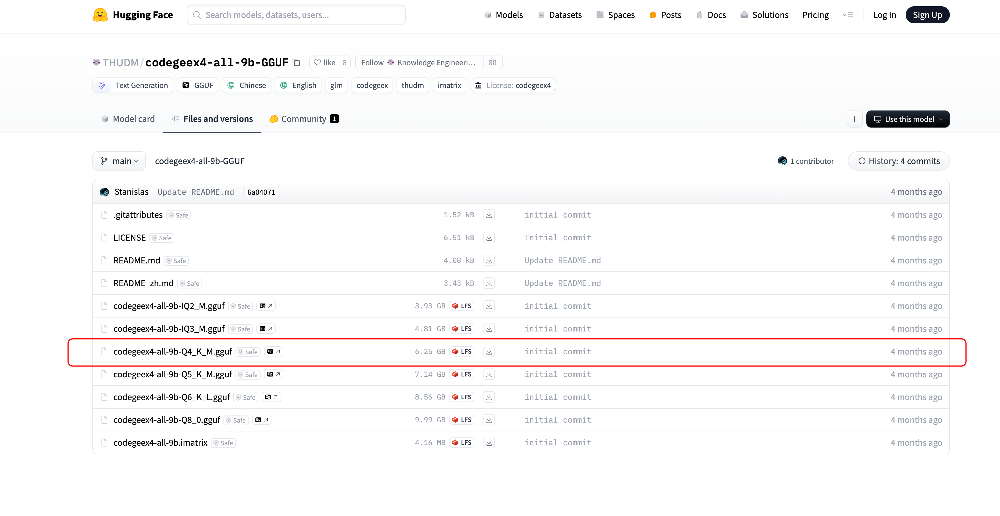

## <font style="color:rgb(36, 41, 47);background-color:rgba(255, 255, 255, 0);">Ollama简介：快速了解一键部署工具</font>
Ollama是一款专为简化AI模型部署而设计的工具。它支持多种模型的本地部署，确保用户能够在不依赖云服务的情况下，快速启动和运行AI应用。

#### 为什么选择Ollama？
1. **简便易用**：Ollama提供直观的用户界面和简单的操作步骤，即使是非技术用户也能轻松上手。
2. **本地部署**：通过本地部署，用户可以更好地控制数据安全和隐私，避免数据泄露的风险。
3. **高效性能**：Ollama优化了模型的运行效率，确保在本地环境中也能获得出色的性能表现。
4. **广泛兼容**：支持多种AI模型和框架，满足不同用户的需求。

#### Ollama的核心功能
+ **一键安装**：无需复杂的配置，轻松完成模型的安装和启动。
+ **自动更新**：保持模型和工具的最新版本，确保最佳性能和安全性。
+ **社区支持**：活跃的用户社区提供丰富的资源和支持，帮助用户解决问题。

这里是Ollama动手学习的系列文档：[https://datawhalechina.github.io/handy-ollama/#/](https://datawhalechina.github.io/handy-ollama/#/)

## <font style="color:rgb(36, 41, 47);background-color:rgba(255, 255, 255, 0);">CodeGeex是什么？探索AI的潜力</font>
CodeGeex是一款基于大模型的智能编程助手，它可以实现代码的生成与补全、自动为代码添加注释、自动解释代

码、自动编写单元测试、实现代码审查Code Review、自动修复代码fixbug、自动生成commit message完成git提交，以及在不同编程语言的代码间实现互译、针对技术和代码问题的智能问答等丰富的功能。帮助开发者显著提高工作效率，CodeCeeX支持300+种编程语言，适配多种主流IDE平台，包括Visual Studlo Code, JetBrains IDES，Visual Studio, HBuilderX， Deepln-IDE等。

## <font style="color:rgb(36, 41, 47);background-color:rgba(255, 255, 255, 0);">为什么选择本地部署？数据安全与隐私保护</font>
在当今高度数字化的世界中，数据安全和隐私保护变得尤为重要。选择在本地环境中部署AI模型，如CodeGeex，能够有效保障用户的数据安全。相比于云端部署，本地部署无需将敏感数据传输到外部服务器，从而减少了数据泄露的风险。此外，本地部署还提供了更高的控制权和灵活性，用户可以根据自身需求调整和优化模型的运行环境。这种方式不仅保护了隐私，还提升了对数据的掌控力，确保AI工具在一个安全、可靠的环境中运行。

## Install Ollama Offline
### Download the Installer
Download the appropriate installation package from the official [Release](https://github.com/ollama/ollama/releases) page, based on the server’s CPU type. After downloading, upload the package to the server.


Ollama Release

### Installation
Extract the installation package `ollama linux amd64.tgz`, navigate to the extracted directory, and run the `install.sh` script to complete the installation.

```plain
# Extract the installation package
tar -zxvf Ollama\ Linux\ AMD64.tgz
# Move the ollama executable to the /usr/bin directory
sudo mv bin/ollama /usr/bin/ollama
```

## Start and Enable Auto-Start
1. Create an execution user. This step can be skipped; you can directly set `root` or any other user with `ollama` execution permissions.

```plain
sudo useradd -r -s /bin/false -U -m -d /usr/share/ollama ollama
sudo usermod -a -G ollama $(whoami)
```

1. Create a configuration file

Create the file `/etc/systemd/system/ollama.service` and populate it with the following content, filling in the `User` and `Group` fields based on your choice in the previous step.

```plain
[Unit]
Description=Ollama Service
After=network-online.target

[Service]
ExecStart=/usr/bin/ollama serve
User=ollama
Group=ollama
Restart=always
RestartSec=3
Environment="PATH=$PATH"

[Install]
WantedBy=default.target
```

Then execute the following commands

```plain
# Load the configuration
sudo systemctl daemon-reload
# Enable auto-start on boot
sudo systemctl enable ollama
# Start the ollama service
sudo systemctl start ollama
```

## Offline Model Installation
Here, we will use the `gguf` model installation method. The installation methods for models are quite similar, and you can refer to the following steps.

## Qwen2.5-Coder
1.Download the model. [https://ollama.com/library/codegeex4](https://ollama.com/library/codegeex4)


search huggingface model

You can choose any fine-tuned version; here, we refer to the model version selected on `ollama`, as shown in the figure below.



下载完成之后，上传到Ollama所在服务器，按照Ollama template创建 Modelfile

```plain
# Model name from the previous step
FROM ./codegeex4-all-9b-Q4_K_M.gguf

# You can find the template for the model on the ollama website, such as the template address for qwen2.5-3b: https://ollama.com/library/qwen2.5:3b/blobs/eb4402837c78
# Directly copy the Template from ollama into the three double quotes below
TEMPLATE """
[gMASK]<sop>{{ if .System }}<|system|>
{{ .System }}{{ end }}{{ if .Prompt }}<|user|>
{{ .Prompt }}{{ end }}<|assistant|>
{{ .Response }}
"""

# This step refers to the parameters on ollama; however, there are no parameters for qwen2.5-3b on ollama. You can add them in the following format.
PARAMETER stop "<|im_start|>"
PARAMETER stop "<|im_end|>"
```

4.Execute the following commands to load and run the offline model.

```plain
# Create and run the qwen2.5 model using the model description file
ollama create codegeex4 -f Modelfile
# Check the list of running models to see if it is active
ollama ls
```

## 安装Vscode-codegeex插件
<font style="color:#0d0016;">接下来，按照下面的步骤，就可以把CodeGeeX4-ALL-9B接入到您的CodeGeeX插件本地模式中。</font>

<font style="color:#0d0016;">1. 在VSCode、JetBrains全家桶的IDE插件市场中，搜索「CodeGeeX」，点击下载安装插件。</font>

<font style="color:#0d0016;">2. 配置跨域所需的环境变量</font>

<font style="color:#0d0016;">在终端输入</font>

```plain
export OLLAMA_ORIGINS="*"
```

或

```plain
launchctl setenv OLLAMA_ORIGINS "*"
```

<font style="color:#0d0016;">来设置环境变量，Windows环境可以在环境变量中手动配置。</font>

```plain
export OLLAMA_HOST=0.0.0.0:port
```

<font style="color:#0d0016;">3. 设置后需要重启 Ollama 服务和 IDE(VSCode 或其他环境) 使环境变量生效。</font>

<font style="color:#0d0016;">4. 启动CodeGeeX4，在终端输入</font>

```plain
ollama serve
```

<font style="color:#0d0016;">打开一个新的终端，在终端输入</font>

```plain
ollama run codegeex4
```

<font style="color:#0d0016;">5. 配置接口地址</font>

<font style="color:#0d0016;">在CodeGeeX插件的本地模式设置中，输入模型地址：</font>

```plain
http://localhost:11434/v1/chat/completions
```

<font style="color:#0d0016;">打开模型配置的高级模式，在模型名称栏填写</font>

```plain
codegeex4
```


<font style="color:#0d0016;">现在就可以享受 CodeGeeX4在本地提供的编码体验！</font>