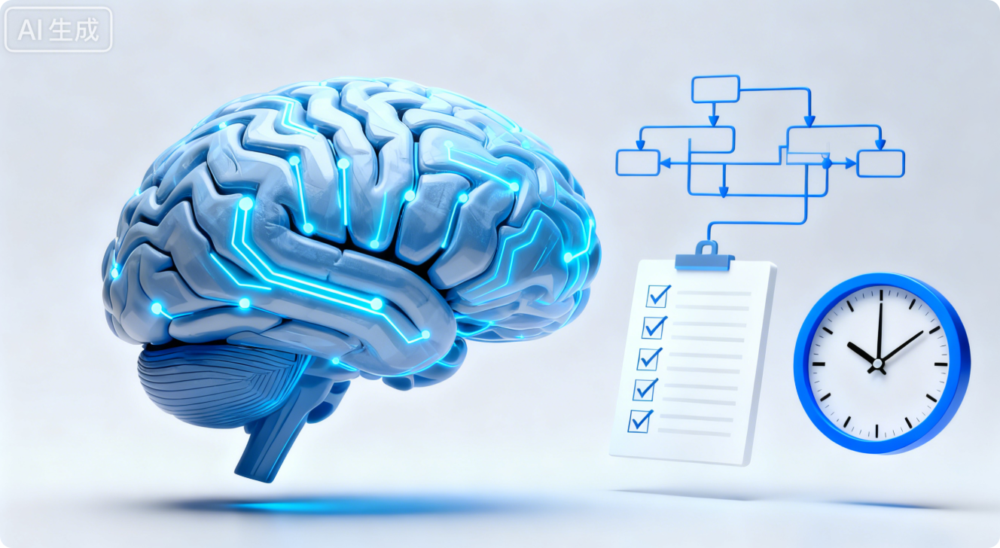

# 如何让大脑变清晰：当你感觉“脑子像卡住的 Windows，需要清理”时应该怎么做？
> 最近我出现了一种很强烈的感觉：**脑子不清醒、不干净、像运行久了的 Windows，需要清理垃圾才能重新变快、变专注。**
我在想，我该怎么让自己的思维重新变得敏捷、轻盈、有效？
>
> 下面是一套系统的整理，让你能快速理解为什么会这样，以及应该怎么做。
>

---

# 🧹 一、为什么会觉得“脑子不干净”？
这种状态其实很常见，通常来自以下几个原因：

+ **信息过载**：输入太多、切换太频繁、大脑缓存撑满
+ **注意力碎片化**：各种消息、社交媒体、微信、任务把你的注意力切成几十块
+ **压力堆积**：未完成的事一直在大脑后台占资源
+ **缺乏休息**：睡眠不足或休息方式无效
+ **长期高强度脑力工作**

可以把它理解成：

> **大脑后台开了几十个程序、内存占满、CPU 跳满，全在忙但都不真正有效。**
>

好消息是，这些都能被清理。

---

# 🧹 二、10–20 分钟的即时“大脑清理”
以下步骤能让你在短时间内恢复清晰感：

## ① 3 分钟快速重启：呼吸 + 望远
+ 坐下
+ 眼睛望远 20 秒
+ 深长呼吸 10 次（吸 4 秒 → 停 2 秒 → 呼 6 秒）

这一动作能让前额叶恢复掌控，是最快的“重启大脑”。

---

## ② 5 分钟“脑下载”：把脑子里的东西全部倒出来
大脑混乱不是因为事情多，而是因为“悬着”。

拿纸或手机写下：

+ 我在担心什么
+ 我被什么卡住
+ 今天必须完成的是什么
+ 目前所有未处理的任务

写出来后，你会立刻感觉轻松，因为大脑不用像后台进程一样一直运行它们。

---

## ③ 2 分钟任务收敛：现在只做一件事
问自己：

> “如果我现在只能做一件事，那是什么？”
>

写下来，然后设定一个 **25 分钟番茄钟**，期间不允许切换。

这一步能立即减少大脑的混乱感。

---

# 🧹 三、系统性的“大脑优化”，让你长期清晰
这些习惯能让你未来更少出现卡顿。

## ① 减少输入：给自己设定“信息清理日程”
你的大脑像浏览器，开太多标签页会卡。

建议：

+ 每天固定两次查看消息（例如 11 点、18 点）
+ 关闭无意义的通知
+ 每天保留至少 2 小时“不被打扰时间”

注意力不是靠更多管理获得，而是靠减少干扰获得。

---

## ② 单任务模式：减少切换成本
每次任务切换都会消耗你的注意力，像不断 Alt + Tab。

训练自己：

+ 每次只做一个主题
+ 用番茄钟让注意力稳定
+ 把“琐事时间”和“深度工作时间”分开安排

---

## ③ 优化睡眠：真正的“大脑系统清理”
深度睡眠是最有效的“大脑垃圾清理系统”，科学上叫“脑淋巴系统”。

最简单但最有效的优化：

+ 睡前 90 分钟不用手机
+ 洗个热水澡／热水泡脚（触发体温下降 → 困意）
+ 房间保持稍微凉一点

这些能显著提高清醒度。

---

## ④ 身体状态支持大脑
你的大脑清晰度，50% 来自身体：

+ 走路 10 分钟
+ 晒 10 分钟太阳
+ 喝水 300ml
+ 吃点坚果、酸奶等含蛋白质的小零食

身体一差，大脑的运行质量一定下降。

---

# 🧠 总结
当你感觉脑子不清楚、像需要“清理垃圾”时，你不是坏掉了，而是：

+ 输入太多
+ 后台进程太多
+ 任务切换太频繁
+ 休息方式无效

通过：
**（1）短期重启**（呼吸、脑下载、单任务）
**（2）长期优化**（减少输入、保证睡眠、身体调节）
你完全可以让自己的大脑重新变得敏锐、清晰、有力量。

# 3 天注意力恢复计划：让大脑重启、思维清晰、口齿伶俐的系统指南
---

# 🧠 一、为什么你会感觉大脑像“卡住”？
现代人普遍处在以下状态：

+ 信息过载
+ 工作碎片化
+ 任务切换频繁 - 节奏快
+ 睡眠不足
+ 焦虑和压力累积
+ 不断刷新社交媒体
+ 高强度脑力劳动

这会让大脑：

+ 充满未完成任务（后台进程）
+ 前额叶效率下降（注意力核心区域）
+ 神经系统长期紧绷（难以放松）
+ 思考速度变慢
+ 自控力下降
+ 表达能力退化

于是，你就感觉——
**“脑子不干净、不清醒、反应慢、做事情力不从心。”**

下面，我们用一个科学、实操的方式来重启你的大脑。

---

# 📅 二、3 天注意力恢复计划（短期重启）
这是一个“人类大脑快速优化协议（HQP）”，你只要按步骤执行，就会感觉思维变快、状态回升。

---

# ▶️ **第 1 天：清理大脑缓存（降噪）**
## **1. 早上：大脑清理（20 分钟）**
### **① 脑下载（10 分钟）**
把脑子里所有的事情写出来：

+ 待办
+ 担忧
+ 今天要做的
+ 未完成任务
+ 卡住的地方
+ 灵感

写出来=从“大脑 RAM”卸载到“硬盘”。

### **② 三件最重要的事（3 分钟）**
写今天最关键的三件事（MIT）。

### **③ 深度工作 25 分钟 × 2**
不查消息，不切换，不中断。

---

## **2. 中午：身体恢复（10 分钟）**
+ 快走 10 分钟
+ 曝光自然光

自然光 + 有氧提升多巴胺，让大脑“开机”。

---

## **3. 下午：数字清理（15 分钟）**
+ 关闭不必要通知
+ 清理手机中无意义 APP
+ 浏览器标签 ≤ 5 个  
+ 微信设为仅特别提醒

减少信息污染，注意力自然变得干净。

---

## **4. 晚上：启动睡眠优化（30 分钟）**
+ 睡前 90 分钟不用手机
+ 洗个热水澡（体温下降 → 困意）
+ 写明天要做的 3 件事

睡眠是大脑“物理垃圾清理”核心。

---

# ▶️ **第 2 天：重建专注系统**
## **1. 早上：专注力热启动（15 分钟）**
+ 拉伸
+ 望远 20 秒
+ 呼吸练习
+ 回顾今天的 3 件最重要的事

然后进行：
**深度工作 25 分钟 × 3（共 75 分钟）**

---

## **2. 下午：注意力训练（10 分钟）**
任选其一：

+ 冥想
+ 专注阅读
+ 用笔写作
+ 单任务执行练习

训练前额叶皮质的“注意力肌肉”。

---

## **3. 晚上：大脑排毒（30 分钟）**
+ 走路
+ 洗澡
+ 听轻音乐
+ 简单阅读

让神经系统从“战斗模式”进入“恢复模式”。

---

# ▶️ **第 3 天：进入稳定高效模式**
## **1. 早上：深度工作黄金两小时**
这是你大脑最强的时候：

+ 手机不进房间
+ 桌面干净
+ 一次 50 分钟 × 2 轮

你会明显感觉效率爆炸式提升。

---

## **2. 下午：思维强化（任选其一）**
+ 写 300 字
+ 阅读 15 分钟
+ 用费曼技巧解释一个概念
+ 用结构化方式分析一个问题

让你的表达能力、逻辑能力变强。

---

## **3. 晚上：复盘（20 分钟）**
写三条：

1. 今天做得好的
2. 需要改善的
3. 明天的重要三件事

保持思维清晰。

---

# 🎉 **三、3 天结束后的变化**
你会明显感受到：

+ 大脑流畅
+ 情绪稳定
+ 注意力变强
+ 工作效率提高
+ 思维更有条理
+ 口齿更清晰、反应更快

这不是错觉，是你的认知系统重新“上线”了。

---

# 🧠 四、长期思维优化习惯（让你持续高效）
这是大脑“长期维护手册”。

---

# **1. 专注力三原则**
+ 每天深度工作 2 小时（早上最佳）
+ 每天只设 3 个关键任务
+ 每天两次查消息（11 点 / 17 点）

---

# **2. 大脑清理系统**
每晚 10 分钟：

+ 写明天的 3 件事
+ 清理悬挂任务
+ 把脑子里的担忧写出来

这是保持精神干净的关键。

---

# **3. 思考力强化**
每周至少两次：

+ 写作 300 字
+ 教别人一个知识点
+ 阅读非碎片内容（文章/书）
+ 做一次结构化思考训练

久而久之，你的表达和逻辑会变得非常强。

---

# **4. 身体优化（影响大脑 50%）**
+ 每天走路 10–20 分钟
+ 晒太阳
+ 喝水
+ 睡够质量
+ 每 1 小时站起来动一动

身体状态 ≈ 大脑性能。

---

# **5. 信息饮食原则**
+ 不刷短视频
+ 不看无意义新闻
+ 每季度做一次数字断舍离
+ 保持输入干净、优质

大脑不是卡，是“被垃圾堵了”。

---

# **6. 环境优化**
+ 工作桌面保持干净
+ 浏览器标签不超过 5 个
+ 手机远离工作区

环境越干净，大脑越清晰。

---

# **7. 心智习惯**
+ 复盘
+ 计划
+ 单任务
+ 不完美主义

能持续高效的人都这么做。

---