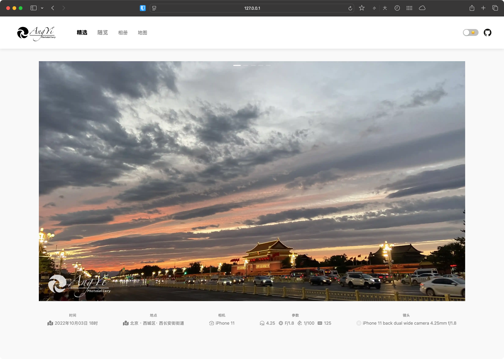
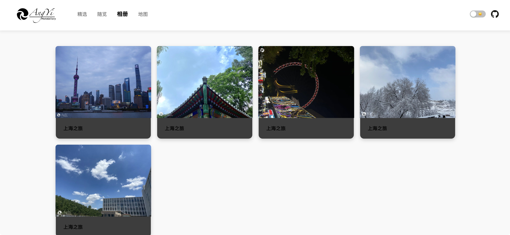
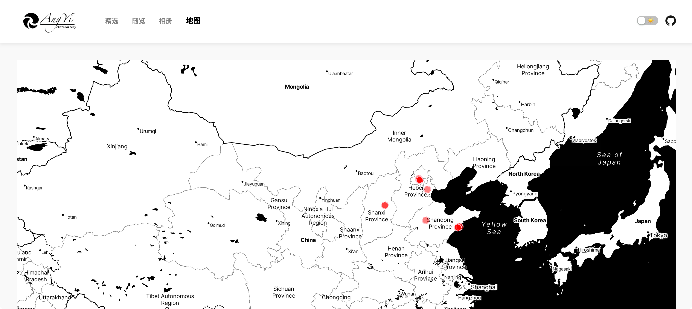
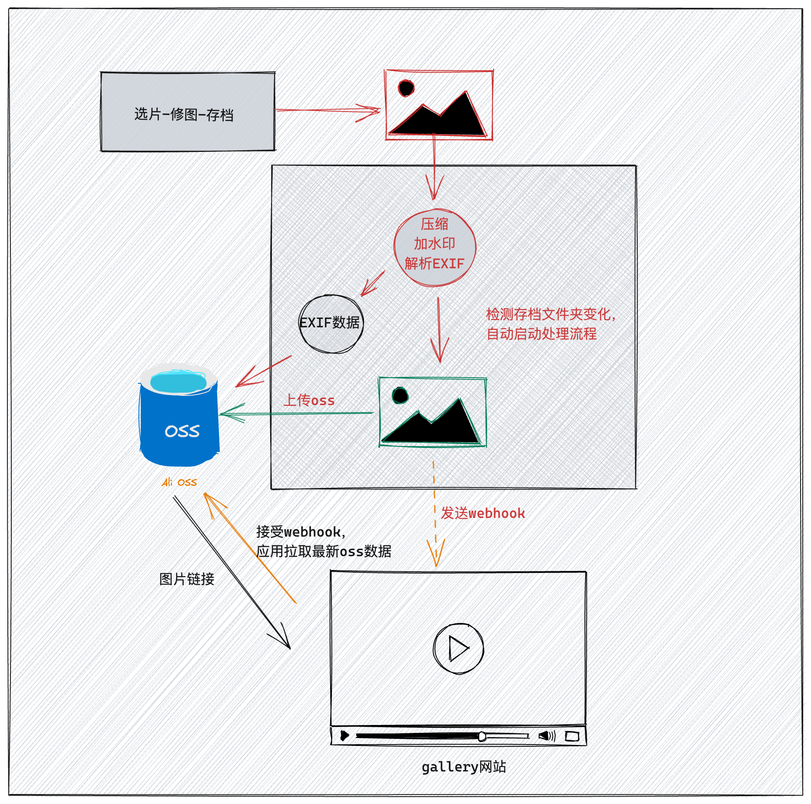

利用周末的时间，搞了一个网站，用来展示一些我的摄影作品。

点击博客左侧的[相册]([AngYi’s Gallery](https://gallery.angyi.online/))链接就是啦～

github 代码仓库的地址： [https://github.com/Flionay/Dash_Photo_Gallery](https://github.com/Flionay/Dash_Photo_Gallery)

## 项目简介
**Dash Photo Gallery **是一个基于 Dash 框架的摄影作品展示平台，旨在为摄影爱好者提供一个高效、自动化的相册管理和展示解决方案。用户可以轻松上传、管理和展示他们的摄影作品，同时享受流畅的用户体验。

### 首页滚动大图，精选集
## 
### 随览页面，按星级排序的所有图片
#### 
### 相册页面
### 地图，按照地点在地图上标记
## 
## 设计方案
作为一个摄影爱好者，希望有一个自己的网页端照片展览。

我相信每一个摄影爱好者肯定有一个比较大的存储设备，文件形态的相册管理着自己的本地相册库。

> 本项目的核心就是，从这个文件库，尽量无感的生成一个网页端的照片展览。尽量减少人工运维和实现高度的自定义处理，具有一定的可移植性。
>

> 我们的宗旨是，摄影，只需要关注于摄影本身，至于从本地文件到网页显示的过程，希望能够全自动化。
>

我们要做的就是拍照，修图，存档。

基于此，这是我的设计思路流程：



### 数据存储
+ **本机相册库&处理上传脚本**：在本地（nas）上运行一个脚本，监控文件夹，处理图片，上传oss （没有通用的，适合自己的就是最好的，所以可以自己修改脚本）
+ **阿里云 OSS**：用于存储图片和相册数据。
+ **OSS图床直链数据文件（json）**：从 OSS Bucket 中罗列文件，生成 JSON 文件，便于前端渲染，存储oss图床直链，就不搞什么数据库了，没必要。
+ **Dash 前端**：利用Dash框架，渲染相册，展示相册。

## 功能特点
1. **自动监控**：每隔 15 分钟监控文件目录，自动处理新增或修改的图片。
    - 处理图片，避免重复处理。
    - 将压缩后的 WebP 文件上传至 OSS，并生成相应的 YAML 文件以描述相册信息（包括日期和经纬度）。
2. **数据库生成**：从 OSS Bucket 中罗列文件，生成 JSON 数据库，便于前端渲染。
3. **动态渲染**：利用 JSON 数据进行 Dash 渲染，实时更新相册内容。
4. **地图展示**：在地图上显示图片位置，点击图片可查看详细信息。
5. **明暗主题切换**：支持明暗主题切换

## TODO
1. 添加下载按钮
2. 稍微优化一下评分登录页面

## 使用说明
### 环境要求
+ Python 3.x
+ Dash
+ 阿里云 OSS SDK
+ 其他依赖库（请参考 `requirements.txt`）

### 安装步骤
1. 克隆项目：

```bash
git clone https://github.com/yourusername/dash-photo-gallery.git
cd dash-photo-gallery
```

2. 安装依赖：

```bash
pip install -r requirements.txt
```

3. 配置环境变量：
    - 创建 `.env` 文件并添加阿里云 OSS 的相关配置：

```plain
OSS_ACCESS_KEY=your_access_key
OSS_SECRET_KEY=your_secret_key
OSS_ENDPOINT=your_endpoint
OSS_BUCKET=your_bucket_name
watch_dir=your_watch_directory
```

4. 运行应用：

```bash
python main.py
```

5. 访问应用：
打开浏览器并访问 `http://127.0.0.1:8050`。
6. 管理员可以给照片评分：
访问 `http://127.0.0.1:8050/star`。 登录后可以给照片评分（账号密码在.env文件设置）。

## 贡献
欢迎任何形式的贡献！请提交问题或拉取请求。

## 许可证
本项目采用 MIT 许可证，详情请查看 [LICENSE](LICENSE) 文件。

## 联系方式
如有任何问题或建议，请联系：

+ 邮箱：angyi_jq@163.com
+ GitHub：[Flionay](https://github.com/flionay)