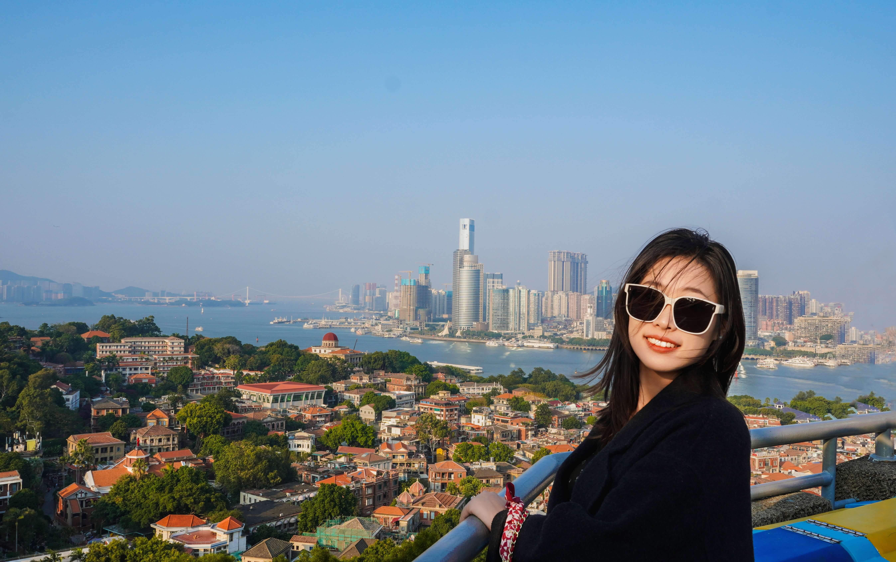
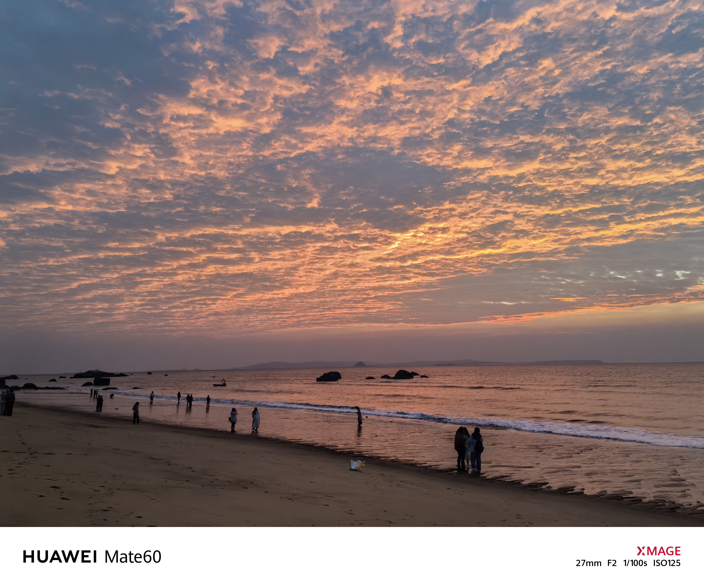
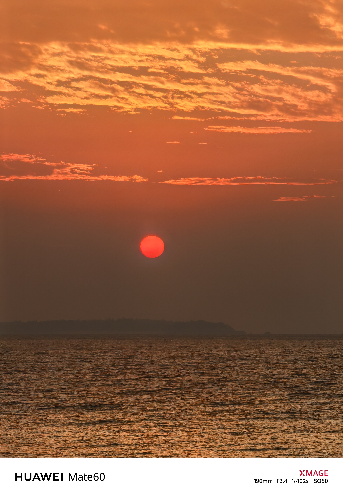
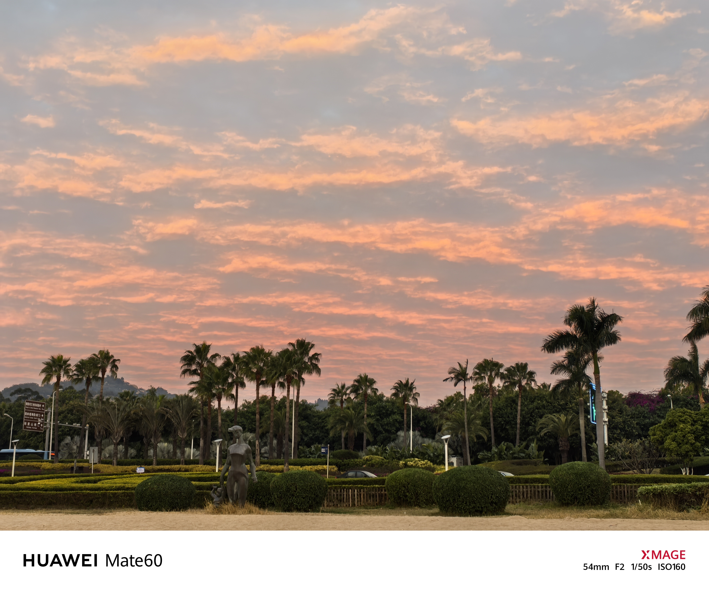

福州与厦门，这两座东南沿海的明珠，一直以来都散发着独特而迷人的魅力。怀揣着满心的期待，我终于踏上这片令人心驰神往的土地，开启了一段精彩纷呈且难以忘怀的旅程。

## 福州：古韵与新趣交织的宝藏之地
第一天到达福州，是在凌晨，我们选了一个离机场比较近的酒店，大半夜的导航到酒店门口，只能停在路边，一下车感觉到了什么阴森之地，虽然是定的海景房，但是很荒凉，因为比较晚了，也没多想就匆忙入住了，感觉是一个海边废弃的写字楼改的酒店，第二天起来，天气灰蒙蒙的，海边景色也不是很好，我们打算去市里玩一圈。

第一站导航的是福州西禅古寺，去感受一下当地的宗祠寺庙文化，与山西好像有很大的不同，但是好像又很类似。不同在于它修建在市区，而且有水，绿色植被围绕，是一种带有湿润的香火味，山西的寺庙都位于山上，香火中带着一种山风的凌冽。

第二站是三坊七巷，踏入这片区域，只见白墙青瓦相互映衬，石板铺就的小巷蜿蜒曲折，仿佛是一位位老者，静静地诉说着往昔那些动人心弦的故事。信步其间，古宅大院鳞次栉比，错落有致。每一扇门扉、每一扇窗棂之上，皆雕琢着精美绝伦的图案，其细腻的工艺、精妙的设计，无不令人对古代工匠们的高超技艺赞叹不已。这里是最有福建特色的地方了，白墙灰顶的建筑，小巷茶馆。看到这里的人在太阳底下喝着小茶，真幸福啊，惬意，跟北京这种打工城市完全不一样，20元来壶茶能坐一下午，三五朋友坐下聊聊天。可惜我的行程比较紧，还想着去厦门玩，不然一定坐下来，点壶茶坐一下午。

还去了林则徐纪念馆，记录虎门销烟的这位伟人是如何在福建生活的，后面就去了上下杭，傍晚出发去厦门，考虑到开夜车比较远，所以选择去莆田下高速，感受一下莆田的美食和莆田电商小镇独特的上楼特产，你懂的。

## 厦门：鼓浪屿日落

到了厦门，就盼着能在海边看日落和日出。

早上从莆田直奔厦门鼓浪屿，买了联票，中午在码头吃了一份猪脚饭（还不错），雯儿吃了一份咖喱面（很难吃），因为在路上是我在副驾驶，没干好僚机的工作，买票有点买迟了，只能买中午点的高等船票（完全不值当的，去的时候窗外都会被甲板游客挡住，而且回程是一样的船，12月份海风吹的嗖嗖冷啊）。

去了岛上还是很好的，有那种南方海岛的氛围，绿色的草地上长着高高的芭蕉树叶椰子树，海边绿化带在十二月份依然花团锦簇，围着岛边吹着海风绕一圈，最后爬上了日出岩，属于是小岛的制高点，可以俯瞰整个厦门海岸，有点维多利亚港的感觉。

傍晚在鼓浪屿看了海上落日，静静的等待希望消失在海面上，那个时刻，感觉出现在你身边的游客都是一种缘分，一种想要认识的感觉。

## 厦门：黄厝海滩日出

第二天早上五点半就从酒店出发，去了印象黄厝海滩，去看日出

这次看日出的经历，是整个福州厦门之行的让我印象最深的一个场景，太浪漫了

东边的天刚有点发白，我就激动得不行。慢慢地，太阳露出一点边儿，红彤彤的，光线透过夜色隐隐约约的透出来，我加快了车速，往目的地出发。

当我们到黄厝海滩的时候，夜色已经包不住红彤彤的日光，像希望的染料一样，逐渐印染在海平面尽头的云层上。不一会儿天空有粉色出现。早上的云层也非常给力，浓郁但是很薄，而且在日出的位置有一个空隙，红日从那个空隙穿透出来，震撼的照射到了每一朵云团上。

日出的颜色是渐变的，由粉色转为红色，逐渐转为亮白色，在这个氛围下，有个小插曲。

正当我们眼泪盈眶（冻的），沉醉在这片粉红色的时候，有个修道之人漫步来到我们面前，突然开始了佛法，说我面向大方，额头这颗痣叫做吉星高照，必是成大事之人，同时有几点需要注意，巴拉巴拉。然后说雯儿，旺夫相，说我们平日生活幸福恩爱（不恩爱也不会一大早来厦门海滩看日出不是）。 在那样浪漫的场景下，突然来这么个人，加上他我佛慈悲看破我们生辰八字的话术，我以为还是我们幸运怎么着，遇到了，心里还有意外+惊喜。大师还送了雯儿一个手串，说你带着这个，刚才给你说的注意事项都不是事情，保你顺顺利利。多重情感直接冲击我的小心灵，大脑来不及处理了，疯狂跟大师双手合十鞠躬，谢谢谢谢...

直到，他从兜里掏出来了手机，打开了收款码... 我悟了大师，大师，我悟了！

---

