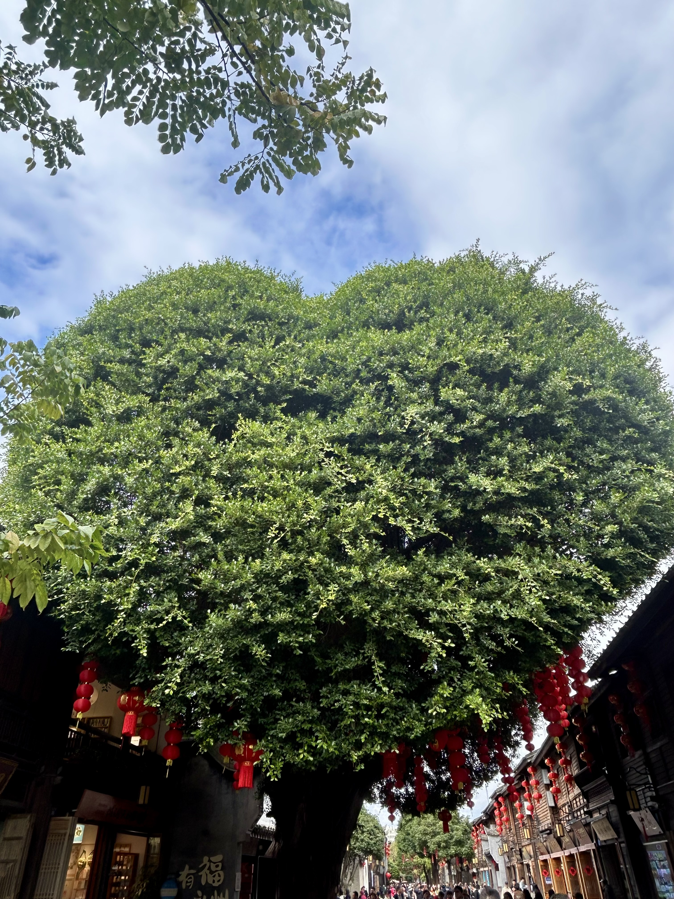
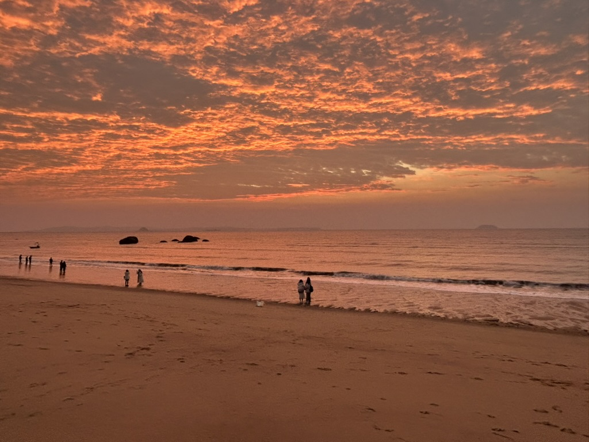

福福州与厦门，这两座东南沿海的明珠，一直以来都散发着独特而迷人的魅力。怀揣着满心的期待，我终于踏上这片令人心驰神往的土地，开启了一段精彩纷呈且难以忘怀的旅程。

## 福州：古韵与新趣交织的宝藏之地
第一天到达福州，是在凌晨，我们选了一个离机场比较近的酒店，大半夜的导航到酒店门口，只能停在路边，一下车感觉到了什么阴森之地，虽然是定的海景房，但是很荒凉，因为比较晚了，也没多想就匆忙入住了，感觉是一个海边废弃的写字楼改的酒店，第二天起来，天气灰蒙蒙的，海边景色也不是很好，我们打算去市里玩一圈。

第一站导航的是福州西禅古寺，去感受一下当地的宗祠寺庙文化，与山西好像有很大的不同，但是好像又很类似。不同在于它修建在市区，而且有水，绿色植被围绕，是一种带有湿润的香火味，山西的寺庙都位于山上，香火中带着一种山风的凌冽。

第二站是三坊七巷，踏入这片区域，只见白墙青瓦相互映衬，石板铺就的小巷蜿蜒曲折，仿佛是一位位老者，静静地诉说着往昔那些动人心弦的故事。信步其间，古宅大院鳞次栉比，错落有致。每一扇门扉、每一扇窗棂之上，皆雕琢着精美绝伦的图案，其细腻的工艺、精妙的设计，无不令人对古代工匠们的高超技艺赞叹不已。这里是最有福建特色的地方了，白墙灰顶的建筑，小巷茶馆。看到这里的人在太阳底下喝着小茶，真幸福啊，惬意，跟北京这种打工城市完全不一样，20元来壶茶能坐一下午，三五朋友坐下聊聊天。可惜我的行程比较紧，还想着去厦门玩，不然一定坐下来，点壶茶坐一下午。

还去了林则徐纪念馆，记录虎门销烟的这位伟人是如何在福建生活的，后面就去了上下杭，傍晚出发去厦门，考虑到开夜车比较远，所以选择去莆田下高速，感受一下莆田的美食和莆田的特产，你懂的。

## 厦门：海边看日落日出，超浪漫
到了厦门，就盼着能在海边看日落和日出。傍晚的时候，我早早地就跑到鼓浪屿的海边。太阳慢慢往下落，天空变得橙红橙红的，那颜色映在海面上，海也跟着变得金黄金黄的，海浪轻轻拍打着沙滩，发出沙沙的声音，就像在给日落伴奏呢。我就站在那儿看着太阳一点点没入海里，心里可平静了，啥烦心事都没了。

为了看日出，天还黑着我就到环岛路了。东边的天刚有点发白，我就激动得不行。慢慢地，太阳露出一点边儿，红彤彤的，光线照在海面上，海水一下子就变成金色的了。太阳越升越高，整个天空都亮了，那场面太震撼了，感觉自己在大自然面前好渺小，又好像和周围的一切都融在一起了。

在厦门，除了看日出日落，还可以在曾厝垵的小巷子里闲逛，吃各种好吃的小吃。或者去南普陀寺逛逛，爬到高处看看厦门的全景，听听钟声，闻闻香火气，心里可安静了。

福州和厦门就像两颗不一样的星星，福州充满了历史的韵味，像老酒，越品越香；厦门的海景浪漫得像画儿一样，让人陶醉。这次旅行太棒了，看了好多美景，也留下了好多美好的回忆。真希望下次还能来，说不定又能碰到啥新鲜好玩的事儿呢！