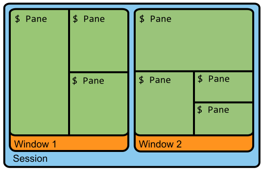

## 终端复用工具tmux简介及常用快捷键
### tmux的Layouts基本概念:
1、服务（Server）

2、会话（Session）：建立一个tmux工作区会话；

3、窗口（Window）：容纳多个窗格；

4、窗格（Pane）：可以在窗口中分成多个窗格。



### tmux的常用快捷键
注意:在使用下面的快捷键的时候，需要首先使用主键：`Ctrl + b`（也称为激活键），也称为快捷键前缀，然后再按下相应操作的快捷键即可执行相应的操作了。

1、tmux的窗口

| 快捷键 | 描述 |
| --- | --- |
| `c` | 新建窗口 |
| `&` | 关闭窗口 |
| `l` | 切换窗口 |
| `n` | 切换到下一个窗口 |
| `p` | 切换到上一个窗口 |
| `w` | 窗口的菜单列表 |

2、tmux的窗格

| 快捷键 | 描述 |
| --- | --- |
| `"` | 水平分屏 |
| `%` | 垂直分屏 |
| `x` | 关闭窗格 |
| `;` | 切换窗格 |
| `o` | 逆时针切换窗格 |
| `Ctrl + o` | 逆时针转换窗格 |

### tmux配置
通常我们可以在`~/.tumux.conf`中对tmux进行配置，如果没有这个文件可以创建一个。

1、设置新的主键（激活键）
由j于tmux系统默认的主键盘为`Ctrl+b`，按起来不是很方便，这里将其设置为`Ctrl+j`

```plain
unbind C-b                # 取消原生的主键
set-option -g prefix C-j  # 将主键设置为C-j
```

2、修改默认的分割窗口按键

```plain
unbind '"'                # 取消原生的水平分屏快捷键
unbind '%'                # 取消原生的垂直分屏快捷键
bind h split-window -v    # 将水平分屏快捷键设置为h
bind v split-window -h    # 将垂直分屏快捷键设置为v
```

> 来自: [终端复用工具tmux简介及常用快捷键_tmux快捷键-CSDN博客](https://blog.csdn.net/weixin_37926734/article/details/124599681)
>