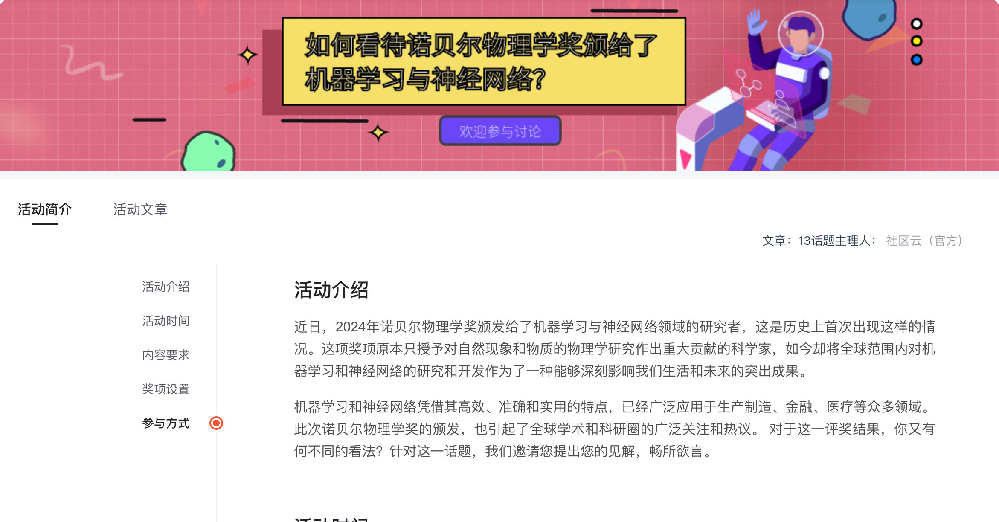
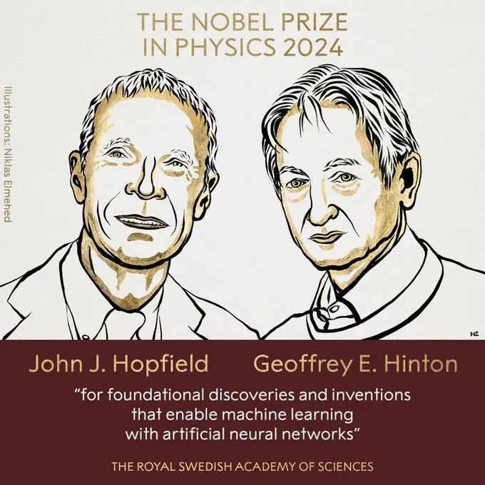

偶然间在CSDN看到了这个官方组织的活动，说明这个话题不止少部分人关注，还是值得思考的。

> 据法新社10月8日斯德哥尔摩消息，诺贝尔委员会表示：“今年的两位诺贝尔物理学奖获得者**利用了物理学方法来寻找信息的特征**，构建了为当今强大的机器学习奠定基础的方法。”
>

> 著名的普林斯顿大学教授、91 岁的约翰-霍普菲尔德和加拿大多伦多大学教授、76 岁的杰弗里-辛顿，“因利用人工神经网络实现自动学习的基础发现和发明”而获奖。
>

这是直接讲物理讲颁给了两位AI教父，以为是神经单元的提出者，另一位是更是“神经网络之父”

给他们一个诺奖是没有任何争议的，毕竟AI的影响力，现在看来可见一斑，可以称之为划时代的革命性事件。

但是颁发的物理学奖，就会引起一点争论，毕竟大家也很担心，AI的发展会不会阻碍传统研究的进步，AI几乎淹没了大半边的研究者论文，几乎所有人都在往这个方向靠

> 诺贝尔物理学奖委员会主席埃伦-蒙斯（Ellen Moons）向媒体解释说："2024 年的获奖者们利用统计物理学的基本概念设计出了人工神经网络，这种网络的功能类似于联想记忆，能在大型数据集中发现规律”。这些人工神经网络已被用于推动粒子物理学、材料科学和天体物理学等不同领域的研究，现在已成为我们日常生活的一部分。
>

> 杰弗里-辛顿（Geoffrey Hinton）被认为是人工智能领域的先驱。他在评委会通知他时反应说，我惊呆了... 我完全想象不到这样的事情（被授予诺奖）会发生。 
>

**诺贝尔委员会强调说，由于他们的工作，人类的工具箱里现在有了一种新的工具，“我们可以选择将其用于良好的目的”。**

## 物理和AI的区别
作为一个浅资历的AI研究人员，我认为AI的前提是数据，是精确反应客观规律的数据。

想起来小时候科学课上的实验，我们研究声音的传播，研究重力加速度，往往会假设是在真空条件下，才能得出课本上的理论声音传播速度和重力加速度值。但是假设我们使用AI来研究这个问题，我们的观测显然是不可能在真空环境得出的，那么得出的模型很可能不是那么接近科学的。

虽然我不知道他们是怎么用AI来研究物理的，但是我感觉从观测数据出发，和从理论公式推到出发，差距还是存在的。

## AI能否替代物理研究
显然AI是不可能代替物理研究的，但是AI作为新时代创新性的工具，我们完全可以利用起来

处理重复的机械工作，提供比较新颖的创新点，快速处理信息，统计过滤海量数据等等。

## AI当道，对于传统物理化学研究会有什么影响
不可否认，AI 的崛起为各个领域带来了翻天覆地的变化，物理化学研究也不例外。一方面，AI 为传统物理化学研究提供了强大的工具和新的研究方法。通过大数据分析和机器学习算法，科学家们可以更快速地处理海量的实验数据，从中挖掘出有价值的信息和规律。

另一方面，AI 也可能引发传统物理化学研究范式的转变。传统的研究往往依赖于科学家的经验和直觉，通过不断的实验和试错来探索未知。而 AI 则可以通过对大量数据的学习，自主地发现新的科学问题和解决方案。这意味着，**未来的物理化学研究可能更加注重数据的收集和分析，以及与 AI 技术的深度融合**。科学家们需要不断学习和掌握新的技术手段，以适应这种变化。

然而，我们也不能过分夸大 AI 对传统物理化学研究的影响。传统物理化学研究有着深厚的理论基础和实验方法，这些是 AI 无法替代的。物理化学的基本定律和原理是经过长期的实践和验证而确立的，它们为我们理解自然界提供了坚实的框架。同时，实验仍然是物理化学研究的重要手段，通过实验，我们可以直接观察和验证理论的正确性，发现新的现象和规律。**AI 虽然可以辅助实验设计和数据分析，但它不能取代人类的创造力和批判性思维。**

此外，AI 在物理化学研究中的应用也面临着一些挑战。例如，数据的质量和可靠性、算法的可解释性、以及伦理和安全问题等。在使用 AI 技术时，我们需要谨慎对待这些问题，确保研究的科学性和可靠性。

综上所述，AI 当道为传统物理化学研究带来了机遇和挑战。我们应该积极拥抱 AI 技术，将其与传统的研究方法相结合，发挥各自的优势，共同推动物理化学研究的发展。同时，我们也不能忽视传统物理化学研究的价值，继续坚守科学的精神和方法，为人类认识自然、改造自然做出更大的贡献。